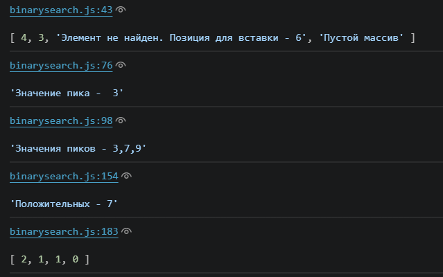

# BinarySearch
Показаны решения задач второй практической работы

Реализованы 4 задачи в соответствии с материалами

Для пиков реализованы функции бинарного поиска и поиска всех пиков

В 3 задании функция возвращает количество чисел и подпись положительных или отрицательных

В 4 задании вывод представляет собой массив элементов с цоличеством меньших после них по индексам

Скринщот результатов выполнения кода для всех заданий(Для номера 3 два вывода: первый с функцией реализованной с помощью бинарного поиска и возвращающей один пик, второй - для поиска всех пиков массива)

